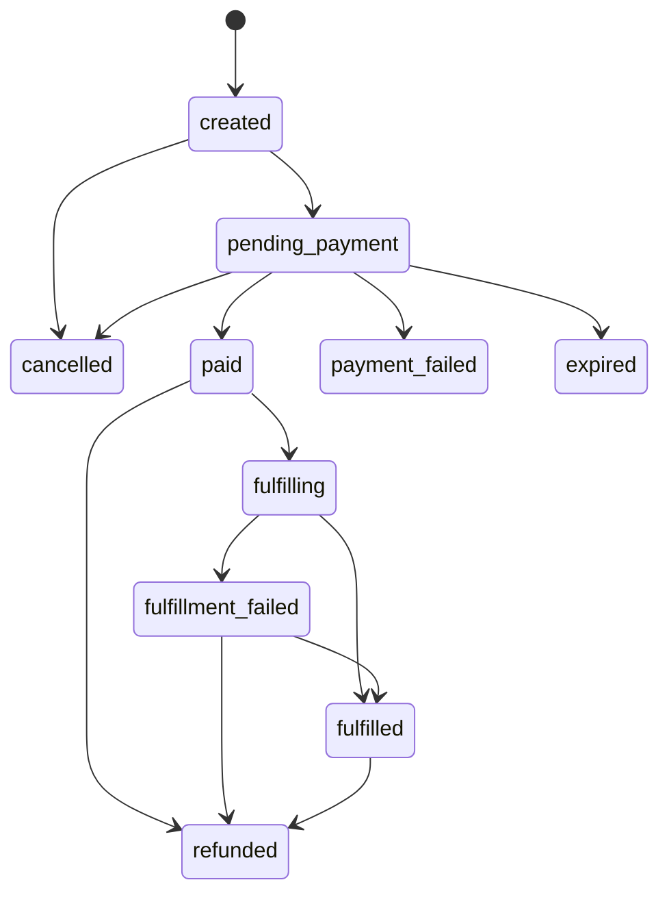

# P6支付与订单设计

更新时间：2026-07-01

## 1. 目标

P6 的第一步不是把 mock 支付替换成真实支付，而是先建立真实收款所需的订单模型、状态机、回调处理和运营核对规则。

本设计只定义开发前约束，不直接接入支付平台。

## 2. 当前前提

- 国内站点已由用户确认完成线上部署。
- 当前代码仍是 MVP mock 原型。
- 真实 AI、真实支付、完整账户系统尚未接入。
- 正式域名在当前环境中 `http://laozuzongxuanxue.cn/` 可返回 200；HTTPS 与 `www` 当前环境访问仍需复验。

## 2.1 第一版支付方案决策

第一版建议采用“单一支付平台先跑通”的方式，避免同时接入多个渠道导致订单、退款和客服复杂度过高。

| 选项 | 建议 | 原因 | 待用户确认 |
|---|---|---|---|
| 微信支付 | 已确认首选 | 国内移动端覆盖高，适合作为第一版单渠道验证 | 正式阶段商户号、签约产品、退款权限 |
| 支付宝 | 暂不接 | 可作为第二渠道补充 | 暂无 |
| 聚合支付 | 暂不建议 | 降低接入门槛但增加第三方依赖、费率和对账复杂度 | 是否有明确服务商 |

默认执行口径：

- 第一版只接微信支付。
- 测试阶段使用个人主体只做产品流程、订单状态和技术联调设计，不进行真实收款。
- 正式收款阶段升级为个体工商户主体，并完成微信支付商户号、签约产品和结算账户配置后，才进入真实支付开发。
- 退款权限正式阶段再开通；退款权限未开通前，不得上线真实收款。
- 订单状态机和数据库设计保持平台无关，但支付回调、查单、关单、退款实现按微信支付 API v3 设计。

## 2.2 用户需确认的支付资料

进入真实支付开发前，需要用户确认：

- 支付平台：微信支付。已确认。
- 测试阶段主体：个人。只做产品和技术测试，不真实收款。已确认。
- 正式阶段主体：个体工商户。已确认为目标状态，待完成主体升级和商户入驻。
- 微信支付商户号是否已开通。
- 网站域名是否已在支付平台侧完成配置。
- 可用支付产品：H5、JSAPI、扫码、App 或其他。
- 退款权限：正式阶段再开通。已确认。
- 结算账户是否已完成认证。
- 客服联系方式和退款处理负责人。

## 2.3 微信支付接入前置条件

根据微信支付官方 H5 场景文档，正式接入前至少需要满足：

- 域名已完成 ICP 备案。
- H5 支付域名已在微信支付商户平台配置，域名填写不包含 `http://` 或 `https://`。
- 商户后台下单时传入 `notify_url`，该回调地址必须是可直接访问的 URL。
- 支付结果通知必须验签，不能只依赖回调内容本身。
- 同一通知可能重复发送，商户系统必须幂等处理。
- 长时间未收到回调时，需要主动查单确认支付状态。

参考：微信支付 H5 支付场景文档 `https://pay.wechatpay.cn/doc/v3/partner/4012079338`。

## 3. 推荐最小支付路径

1. 用户选择服务。
2. 用户填写资料。
3. 系统生成免费摘要或付费前预览。
4. 用户点击购买完整报告。
5. 服务端创建订单，生成唯一订单号。
6. 订单进入 `pending_payment`。
7. 跳转或调起支付。
8. 支付平台异步通知服务端。
9. 服务端校验签名、金额、订单号和支付状态。
10. 订单进入 `paid`。
11. 系统生成或解锁完整报告。
12. 订单进入 `fulfilled`。
13. 用户可在我的记录中查看报告和订单状态。

## 4. 订单状态机

第一版最小状态集合：

| 状态 | 含义 | 可进入状态 |
|---|---|---|
| `created` | 订单已创建，尚未发起支付 | `pending_payment`、`cancelled` |
| `pending_payment` | 已发起支付，等待平台结果 | `paid`、`payment_failed`、`cancelled`、`expired` |
| `paid` | 支付平台确认成功 | `fulfilling`、`refunded` |
| `fulfilling` | 正在生成或解锁报告 | `fulfilled`、`fulfillment_failed` |
| `fulfilled` | 报告已生成或权益已发放 | `refunded` |
| `payment_failed` | 支付失败 | `pending_payment`、`cancelled` |
| `cancelled` | 用户取消或系统关闭订单 | 无 |
| `expired` | 超时未支付 | 无 |
| `fulfillment_failed` | 支付成功但报告生成失败 | `fulfilled`、`refunded` |
| `refunded` | 已退款 | 无 |

## 5. 订单字段

最小订单字段：

- `order_id`：内部订单号。
- `user_id`：可为空；未做账户系统时使用匿名会话或手机号方案前必须另行设计。
- `service_slug`：服务类型，如 `bazi`、`ziwei`。
- `product_name`：商品名称。
- `amount`：实付金额，单位分。
- `currency`：默认 `CNY`。
- `status`：订单状态。
- `payment_provider`：支付平台。
- `provider_trade_id`：支付平台交易号。
- `created_at`、`updated_at`、`paid_at`、`fulfilled_at`。
- `report_id`：支付完成后关联报告。
- `refund_id`：退款时关联退款记录。
- `client_trace_id`：前端幂等追踪 ID。

## 6. 幂等和校验

必须由服务端保证：

- 同一 `order_id` 重复回调只处理一次。
- 支付金额必须等于订单金额。
- 支付平台交易号不能绑定多个订单。
- 未收到可信回调前，前端不得单方面把订单置为 `paid`。
- 报告生成失败时，订单不得静默显示为已完成。

## 6.1 回调验签设计

支付回调必须由服务端处理，前端只负责展示结果。

最小流程：

1. 支付平台向服务端回调地址发送通知。
2. 服务端读取回调头、回调体、时间戳、随机串和签名。
3. 服务端按平台要求使用平台证书或密钥验签。
4. 验签失败直接拒绝，并记录安全日志。
5. 验签通过后，校验 `order_id`、金额、币种、支付状态和平台交易号。
6. 使用数据库事务更新订单状态。
7. 返回支付平台要求的成功响应。

建议回调地址命名：

- `POST /api/payments/{provider}/notify`
- `POST /api/payments/{provider}/refund-notify`

微信支付第一版建议：

- `POST /api/payments/wechat/notify`
- `POST /api/payments/wechat/refund-notify`
- 主动查单任务：按 `order_id` / 微信 `out_trade_no` 查询。
- 主动关单任务：超时未支付订单调用关单或标记过期，避免重复支付。

回调处理必须幂等：

- 同一个平台交易号只允许绑定一个订单。
- 同一个成功回调重复到达时不得重复发放报告。
- 已退款订单不得被后续延迟支付回调改回 `paid`。

## 6.2 退款通道设计

第一版退款只允许从后台或人工客服发起，不在用户端直接自动退款。

当前阶段约束：

- 用户已确认退款权限正式阶段再开通。
- 退款权限开通前，不上线真实收款。
- 若做内部测试，只能使用 mock 支付或微信支付沙箱 / 验证环境，不产生真实用户扣款。

退款流程：

1. 用户提交订单号和退款原因。
2. 运营核对订单、支付状态和报告状态。
3. 符合退款条件时，由后台调用支付平台退款接口或在支付平台后台人工退款。
4. 系统记录 `refund_id`、退款金额、原因、处理人、处理时间和平台退款号。
5. 收到退款结果后更新退款状态和订单状态。

退款条件建议：

- 支付成功但系统未生成报告：可补发报告或全额退款。
- 重复支付：核对后退回重复款项。
- 用户主观不满意：按付费说明执行，不得使用恐吓或诱导话术阻止退款。

## 6.3 状态迁移图

## 6.4 非法状态迁移

| 当前状态 | 禁止迁移 | 原因 |
|---|---|---|
| `cancelled` | `paid` | 已取消订单不能被延迟回调重新置为成功，需人工核查。 |
| `expired` | `paid` | 超时订单不得继续收款，需重新下单。 |
| `refunded` | `fulfilled` | 已退款订单不得继续发放权益。 |
| `payment_failed` | `fulfilled` | 未成功支付不能发放完整报告。 |
| `fulfilled` | `paid` | 已完成订单不得回退到支付成功。 |
| `created` | `fulfilled` | 未支付订单不能直接完成。 |

## 7. 第一版不做

- 不做分销、返佣或优惠券。
- 不做余额钱包。
- 不做多商户分账。
- 不做高价套餐和恐惧式加购。
- 不把祈福心愿写成真实履约承诺。

## 8. 开发前验收

进入真实支付开发前必须确认：

- 支付平台和主体资质已由用户确认。
- 正式阶段微信支付商户号、签约产品和退款权限已确认。
- 订单状态机已落入数据库设计。
- 支付回调地址和验签方式已确定。
- 退款入口和客服处理方式已确定。
- 用户协议、隐私说明和付费说明已准备。
